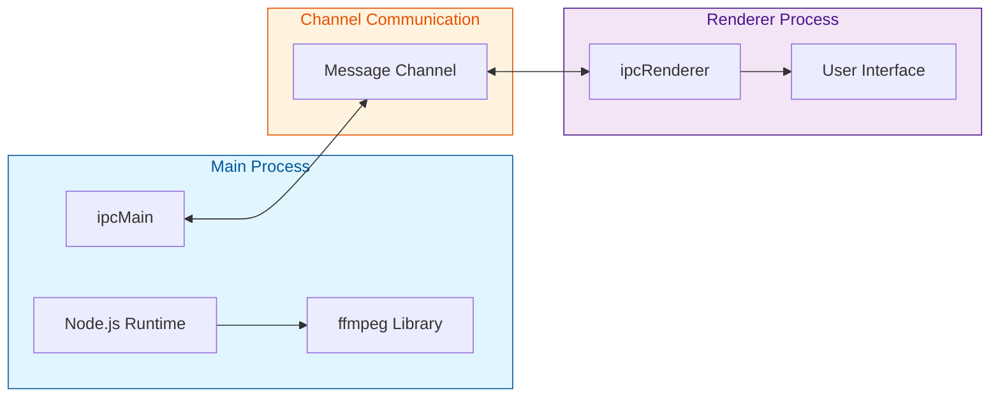

# Video compressor

 

## What is this

This desktop application that allows users compress or convert videos easily through a simple dashboard.

 

## Demo

Step1.  
Upload your video file and select the desired compression settings.  
Click the "Compress" button to start the compression process.

https://github.com/user-attachments/assets/d209c39b-f2ba-4671-a6fe-e83afef4e49f

Step2.  
Upload your video and choose the target video format.  
Click the "Convert" button to begin the conversion.

https://github.com/user-attachments/assets/7d7f076f-a5d8-4bac-b3cc-a1a10e25b0d9

Step3.  
Get the `.dmg` from the releases page and launch the app.

https://github.com/user-attachments/assets/cdb51ad8-4183-4de8-933e-b5d645f6fa71

 

## Built with

| **Category**                             | **Technology**                           |
|------------------------------------------|------------------------------------------|
| Frontend                                 | HTML, TailwindCSS, TypeScript, React     |
| Framework & Tools                        | Electron.js, ffmpeg                      |
| CI/CD                                    | GitHub Actions                           |

 

## Download

[Download from here](https://github.com/tkwonn/video-compressor/releases)

> [!IMPORTANT]
> This application is currently unsigned as it was created solely for learning purposes.   

#### Why is the app unsigned?

Code signing requires an Apple Developer Program subscription and other paid certificates for Windows.

 

## Architecture

Electron's built-in IPC mechanism implements message-passing between the main process, which accesses the OS and ffmpeg via Node.js, and the renderer process, which manages the UI through the HTML DOM.

