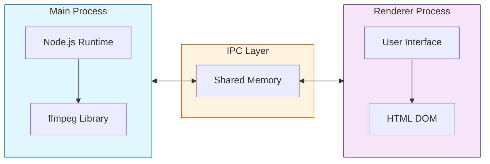

# Video compressor

 

## What is this

This desktop application lets users compress or convert videos easily through a simple dashboard.

 

## Demo

Step1.  
Upload your video file and select the desired compression settings.  
Click the "Compress" button to start the compression process.

Step2.  
Upload your video file and choose the target video format.  
Click the "Convert" button to begin the conversion.

Step3.  
Get the `.dmg` from the releases page and launch the app.

 

## Built with

| **Category**                             | **Technology**                           |
|------------------------------------------|------------------------------------------|
| Frontend                                 | HTML, TailwindCSS, TypeScript, React     |
| Framework & Tools                        | Electron.js, ffmpeg                      |
| CI/CD                                    | GitHub Actions                           |

 

## Download

[Download from here](https://github.com/tkwonn/video-compressor/releases)

> [!IMPORTANT]
> This application is currently unsigned as it was created solely for learning purposes.   

#### Why is the app unsigned?

Code signing requires an Apple Developer Program subscription and other paid certificates for Windows.

## Architecture

